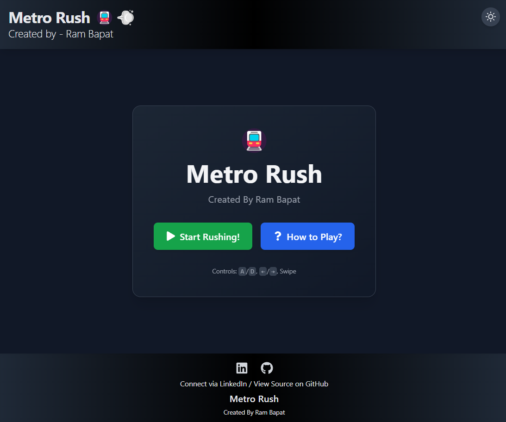
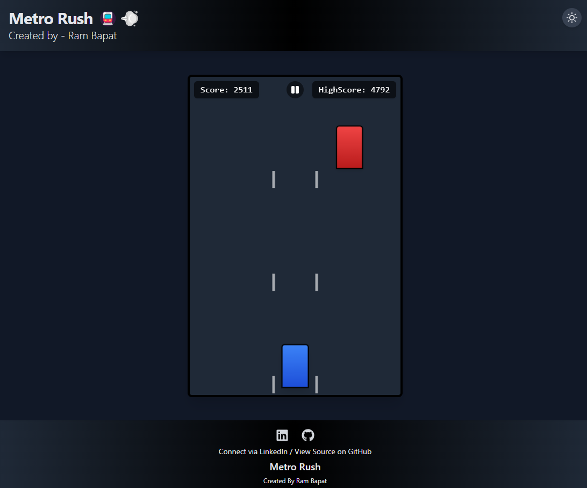
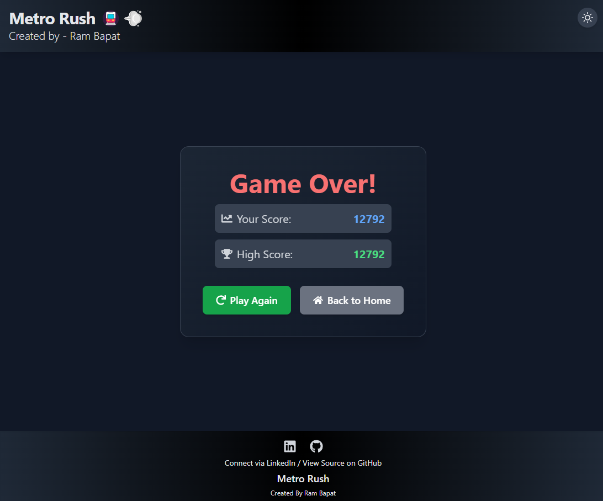
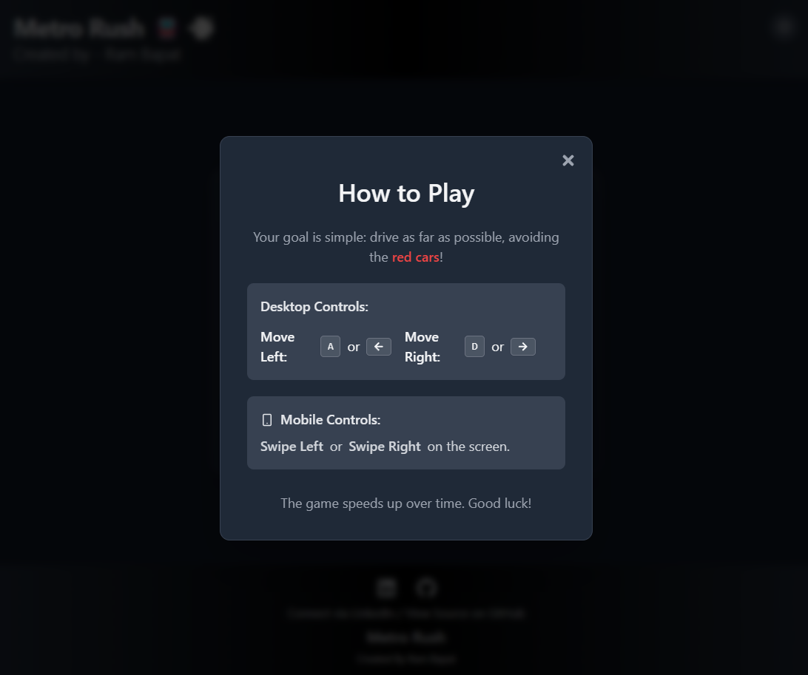
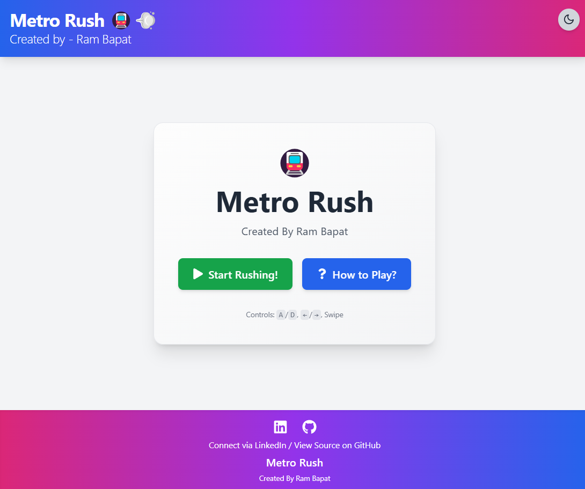

# Metro Rush 🚇💨 (React + Tailwind CSS)

## Try the live demo - [Demo](https://metro-rush.vercel.app/)

A fast-paced, visually appealing 3-lane runner game built with React, Vite, and Tailwind CSS, developed as part of the #30DaysOfVibeCoding challenge with AI assistance.

<!-- ================================================== -->








<!-- ================================================== -->

## Overview

This project is a modern take on the classic lane runner genre, inspired by games like Subway Surfers but simplified for a web experience. The player controls a car trying to dodge incoming obstacle cars across three lanes.

*   **Gameplay:** Navigate left and right to switch lanes and avoid collisions.
*   **Scoring:** The score increases based on the distance traveled (simulated by game speed).
*   **Difficulty:** The game gradually speeds up, increasing the challenge over time.
*   **High Score:** Your best score is saved locally using `localStorage`.
*   **Controls:** Playable with keyboard (A/D or Arrow Keys) and touch swipes (Left/Right) on mobile/tablet.
*   **Theme:** Features a sleek dark mode by default with a toggle for light mode.
*   **End Game:** When the player collides with an obstacle, an end screen displays the final score and high score, offering options to play again or return home.
*   **Vibe Coding:** This project was developed with significant assistance from AI, focusing on rapid iteration, modern UI implementation (Tailwind CSS), and core game logic setup.

## Features

*   **3-Lane Runner Mechanics:** Core gameplay involves switching between three distinct lanes.
*   **Dynamic Obstacle Spawning:** Obstacles appear randomly in lanes at an increasing frequency.
*   **Progressive Difficulty:** Game speed and obstacle spawn rate increase over time.
*   **Score & High Score Tracking:** Real-time score display during gameplay and persistent high score using `localStorage`.
*   **Responsive Controls:** Supports both keyboard (A/D, Left/Right Arrows) and touch swipe gestures.
*   **Dark/Light Theme Toggle:** Easily switch between visual themes, saved to `localStorage`.
*   **Modern UI/UX:** Clean and visually appealing interface built with React and Tailwind CSS.
*   **Multiple Screens:** Includes Start, Game, and End screens, plus a "How to Play" modal.
*   **Component-Based Architecture:** Built with reusable React components.
*   **Smooth Animations & Transitions:** Utilizes CSS transitions for player movement and UI elements.
*   **Efficient Development:** Bootstrapped with Vite for a fast development experience.
*   **Iconography:** Uses `react-icons` for UI elements like theme toggle, modal controls, and buttons.

## Tech Stack

*   **Frontend:** React 18+
*   **Build Tool:** Vite
*   **Styling:** Tailwind CSS v3+
*   **Language:** JavaScript (ES6+)
*   **Icons:** `react-icons`
*   **State Management:** React Hooks (`useState`, `useEffect`, `useRef`, `useCallback`)
*   **Package Manager:** npm

## Getting Started

To get a local copy up and running, follow these simple steps.

### Prerequisites

*   Node.js (v18 or later recommended) installed on your system (includes npm). You can download it from [nodejs.org](https://nodejs.org/).
*   Git (for cloning the repository).

### Installation & Setup

1.  **Clone the repository:**
    ```bash
    git clone https://github.com/Barrsum/Metro-Rush.git
    ```

2.  **Navigate to the project directory:**
    ```bash
    cd Metro-Rush
    ```

3.  **Install NPM packages:**
    ```bash
    npm install
    ```

### Running the Project

1.  **Start the development server:**
    ```bash
    npm run dev
    ```
    This command will start the Vite development server.

2.  **Open the application:**
    Open your web browser and navigate to the local URL provided by Vite (usually `http://localhost:5173/` or a similar port).

## Contributing

Contributions, issues, and feature requests are welcome! Feel free to check the [issues page](https://github.com/Barrsum/Metro-Rush/issues).

1.  Fork the Project
2.  Create your Feature Branch (`git checkout -b feature/AmazingFeature`)
3.  Commit your Changes (`git commit -m 'Add some AmazingFeature'`)
4.  Push to the Branch (`git push origin feature/AmazingFeature`)
5.  Open a Pull Request

## License

Distributed under the MIT License. See `LICENSE.md` for more information.

## Acknowledgements

*   **React:** [react.dev](https://react.dev/)
*   **Vite:** [vitejs.dev](https://vitejs.dev/)
*   **Tailwind CSS:** [tailwindcss.com](https://tailwindcss.com/)
*   **React Icons:** [react-icons.github.io/react-icons/](https://react-icons.github.io/react-icons/)
*   **Vibe Coding Concept/AI Assistance:** Integral part of the development process for the #30DaysOfVibeCoding challenge.

---

Built by Ram Bapat - Challenge [\#30DaysOfVibeCoding](https://www.linkedin.com/posts/ram-bapat-barrsum-diamos_vibecoding-ai-machinelearning-activity-7312839191153860608-wQ8y?utm_source=share&utm_medium=member_desktop) - [LinkedIn Profile](https://www.linkedin.com/in/ram-bapat-barrsum-diamos)